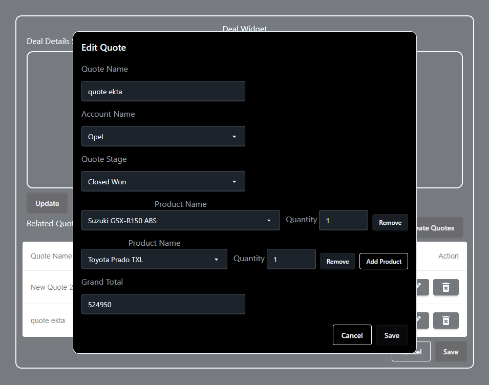
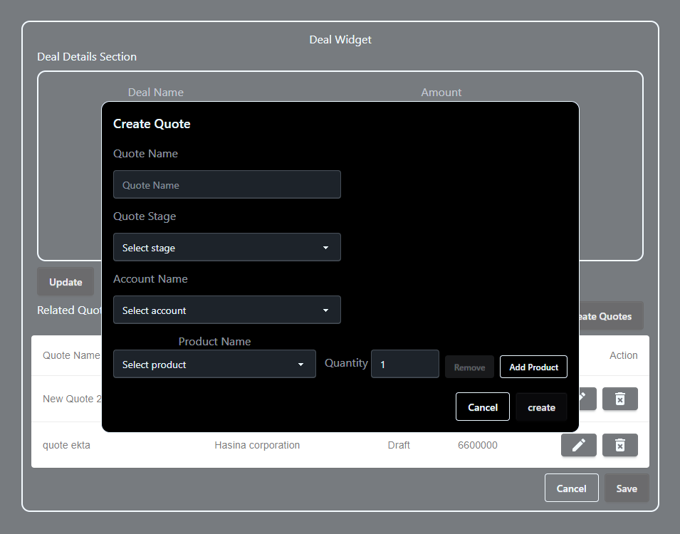
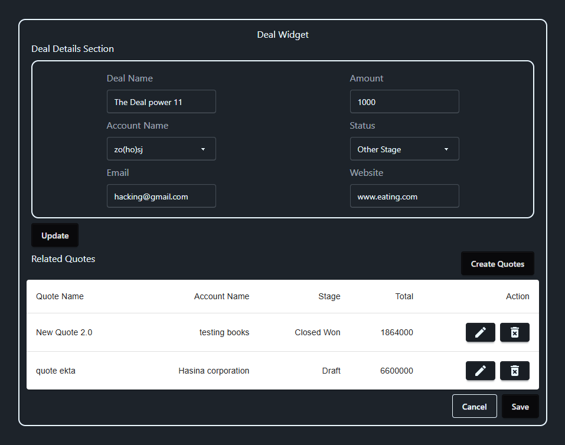
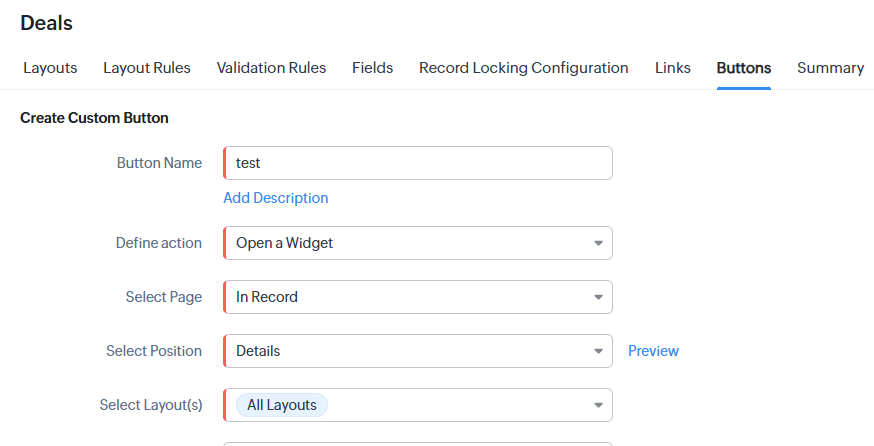
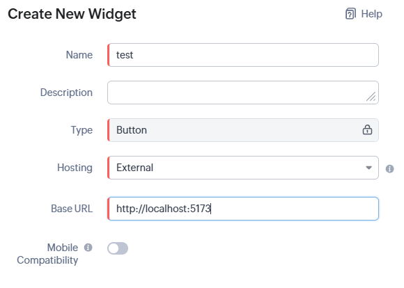

# Zoho CRM Deal Widget

A React + Vite widget for the **Zoho CRM Deal module**.

## 🖼️ Final Product Preview

| Edit Modal                        | Create Modal                      |
| --------------------------------- | --------------------------------- |
| g) |  |

| Main View                                              |
| ------------------------------------------------------ |
|  |

## ✨ What this project does

- Provides a custom Deal widget UI.
- Supports local development with Vite.
- Can be hosted externally and connected in Zoho CRM.

## 📦 Tech stack

- React 19
- Vite
- MUI
- Tailwind CSS + DaisyUI

## 🚀 Quick start

### 1) Clone the repository

```bash
git clone https://github.com/KevAkaSlayer/deal_widget.git
cd deal_widget
```

### 2) Install dependencies

```bash
npm install
```

### 3) Start development server

```bash
npm run dev
```

Default local URL: `http://localhost:5173`

## 🧪 Available scripts

| Command           | Description                      |
| ----------------- | -------------------------------- |
| `npm run dev`     | Start local dev server           |
| `npm run build`   | Build production bundle          |
| `npm run preview` | Preview production build locally |
| `npm run lint`    | Run ESLint                       |

## 🔧 Add this widget to Zoho CRM (Deals)

1. Open **Zoho CRM** and go to the **Deals** module.
2. Click **Create**.



3. In the widget configuration section:
   - Select **New Widget**
   - Choose hosting as **External**
   - Set base URL:
     - Local development: `http://localhost:5173`
     - Production: your hosted app URL



4. Save and install the widget from the popup.
5. After installation shows as **Installed**, select profile(s) and save.

## 📁 Project structure

```text
src/
	components/
	contexts/
	services/
	utils/
```

## ✅ Build for production

```bash
npm run build
```

The production output is generated in the `dist/` folder.
